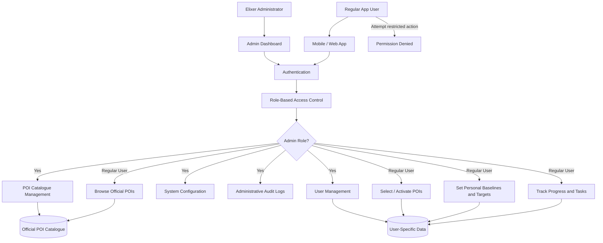

# Admin vs User Permission Architecture

This diagram illustrates the separation between administrator permissions and regular user permissions in Elixer.

```mermaid
flowchart TD
    ADMIN["Elixer Administrator"]
    USER["Regular App User"]

    ADMIN_DASH["Admin Dashboard"]
    MOBILE["Mobile / Web App"]

    AUTH["Authentication"]
    RBAC["Role-Based Access Control"]

    ADMIN_CHECK{"Admin Role?"}

    POI_MANAGEMENT["POI Catalogue Management"]
    USER_MANAGEMENT["User Management"]
    SYSTEM_CONFIG["System Configuration"]
    AUDIT["Administrative Audit Logs"]

    BROWSE["Browse Official POIs"]
    SELECT["Select / Activate POIs"]
    PERSONALIZE["Set Personal Baselines and Targets"]
    TRACK["Track Progress and Tasks"]

    CATALOGUE[("Official POI Catalogue")]
    USER_DATA[("User-Specific Data")]
    DENIED["Permission Denied"]

    ADMIN --> ADMIN_DASH
    USER --> MOBILE

    ADMIN_DASH --> AUTH
    MOBILE --> AUTH

    AUTH --> RBAC
    RBAC --> ADMIN_CHECK

    ADMIN_CHECK -->|Yes| POI_MANAGEMENT
    ADMIN_CHECK -->|Yes| USER_MANAGEMENT
    ADMIN_CHECK -->|Yes| SYSTEM_CONFIG
    ADMIN_CHECK -->|Yes| AUDIT

    ADMIN_CHECK -->|Regular User| BROWSE
    ADMIN_CHECK -->|Regular User| SELECT
    ADMIN_CHECK -->|Regular User| PERSONALIZE
    ADMIN_CHECK -->|Regular User| TRACK

    POI_MANAGEMENT --> CATALOGUE
    BROWSE --> CATALOGUE

    USER_MANAGEMENT --> USER_DATA
    SELECT --> USER_DATA
    PERSONALIZE --> USER_DATA
    TRACK --> USER_DATA

    USER -->|Attempt restricted action| DENIED
```
