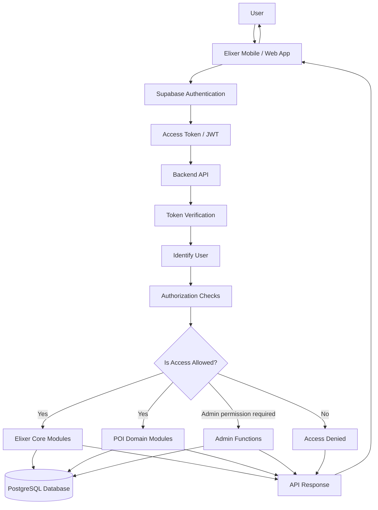

# Authentication and Authorization Flow

This diagram illustrates how Elixer authenticates users and authorizes access to protected resources.

```mermaid
flowchart TD
    USER["User"]
    APP["Elixer Mobile / Web App"]

    AUTH["Supabase Authentication"]
    TOKEN["Access Token / JWT"]

    API["Backend API"]
    VERIFY["Token Verification"]
    IDENTITY["Identify User"]
    PERMISSION["Authorization Checks"]

    POLICY{"Is Access Allowed?"}

    CORE["Elixer Core Modules"]
    POI["POI Domain Modules"]
    ADMIN["Admin Functions"]

    DB[("PostgreSQL Database")]
    DENY["Access Denied"]
    RESPONSE["API Response"]

    USER --> APP
    APP --> AUTH

    AUTH --> TOKEN
    TOKEN --> API

    API --> VERIFY
    VERIFY --> IDENTITY
    IDENTITY --> PERMISSION

    PERMISSION --> POLICY

    POLICY -->|Yes| CORE
    POLICY -->|Yes| POI
    POLICY -->|Admin permission required| ADMIN
    POLICY -->|No| DENY

    CORE --> DB
    POI --> DB
    ADMIN --> DB

    CORE --> RESPONSE
    POI --> RESPONSE
    ADMIN --> RESPONSE
    DENY --> RESPONSE

    RESPONSE --> APP
    APP --> USER
```
