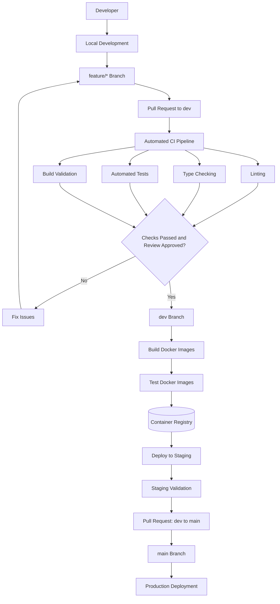

# CI/CD and Git Branching Workflow

This diagram illustrates the Elixer Git workflow and CI/CD pipeline, including Docker image building, testing, publishing and deployment.

```mermaid
flowchart TD
    DEV["Developer"]
    LOCAL["Local Development"]
    FEATURE["feature/* Branch"]
    PR_DEV["Pull Request to dev"]

    CI["Automated CI Pipeline"]
    LINT["Linting"]
    TYPE["Type Checking"]
    TEST["Automated Tests"]
    BUILD["Build Validation"]

    REVIEW{"Checks Passed and Review Approved?"}
    FIX["Fix Issues"]

    DEV_BRANCH["dev Branch"]
    DOCKER["Build Docker Images"]
    IMAGE_TEST["Test Docker Images"]
    REGISTRY[("Container Registry")]

    STAGING["Deploy to Staging"]
    STAGE_TEST["Staging Validation"]

    RELEASE_PR["Pull Request: dev to main"]
    MAIN["main Branch"]
    PROD["Production Deployment"]

    DEV --> LOCAL
    LOCAL --> FEATURE
    FEATURE --> PR_DEV
    PR_DEV --> CI

    CI --> LINT
    CI --> TYPE
    CI --> TEST
    CI --> BUILD

    LINT --> REVIEW
    TYPE --> REVIEW
    TEST --> REVIEW
    BUILD --> REVIEW

    REVIEW -->|No| FIX
    FIX --> FEATURE

    REVIEW -->|Yes| DEV_BRANCH
    DEV_BRANCH --> DOCKER

    DOCKER --> IMAGE_TEST
    IMAGE_TEST --> REGISTRY
    REGISTRY --> STAGING
    STAGING --> STAGE_TEST

    STAGE_TEST --> RELEASE_PR
    RELEASE_PR --> MAIN
    MAIN --> PROD
```
