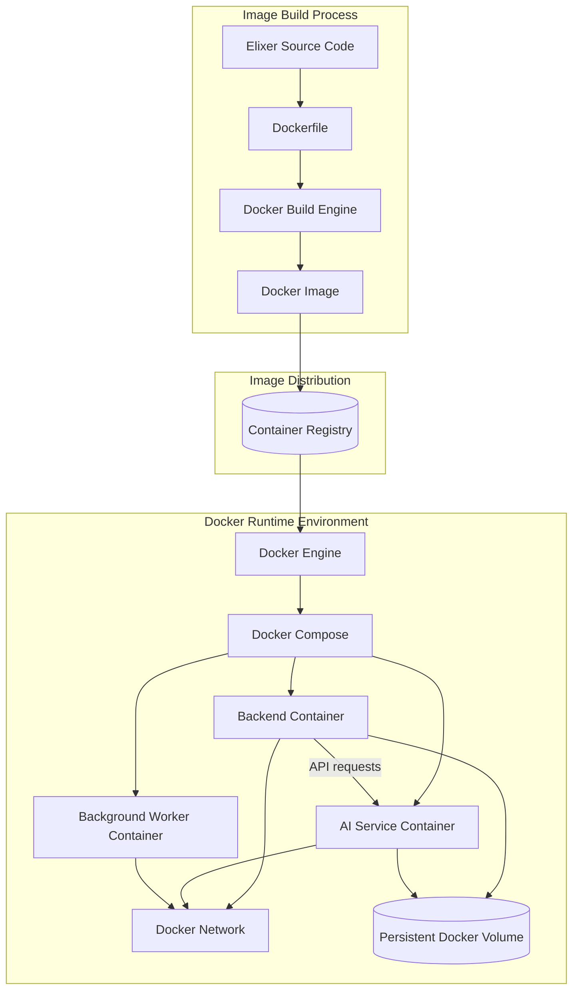

# Docker and Container Architecture

This diagram illustrates how Docker is used in Elixer to package, run and manage backend and AI services across development and deployment environments.

```mermaid
flowchart TD
    SOURCE["Elixer Source Code"]

    subgraph BUILD["Image Build Process"]
        DOCKERFILE["Dockerfile"]
        BUILD_ENGINE["Docker Build Engine"]
        IMAGE["Docker Image"]
        
        SOURCE --> DOCKERFILE
        DOCKERFILE --> BUILD_ENGINE
        BUILD_ENGINE --> IMAGE
    end

    subgraph REGISTRY["Image Distribution"]
        CONTAINER_REGISTRY[("Container Registry")]
    end

    subgraph RUNTIME["Docker Runtime Environment"]
        ENGINE["Docker Engine"]
        COMPOSE["Docker Compose"]

        BACKEND["Backend Container"]
        AI["AI Service Container"]
        WORKER["Background Worker Container"]

        NETWORK["Docker Network"]
        VOLUME[("Persistent Docker Volume")]

        ENGINE --> COMPOSE
        COMPOSE --> BACKEND
        COMPOSE --> AI
        COMPOSE --> WORKER

        BACKEND --> NETWORK
        AI --> NETWORK
        WORKER --> NETWORK

        BACKEND --> VOLUME
        AI --> VOLUME
    end

    IMAGE --> CONTAINER_REGISTRY
    CONTAINER_REGISTRY --> ENGINE

    BACKEND -->|API requests| AI
```
