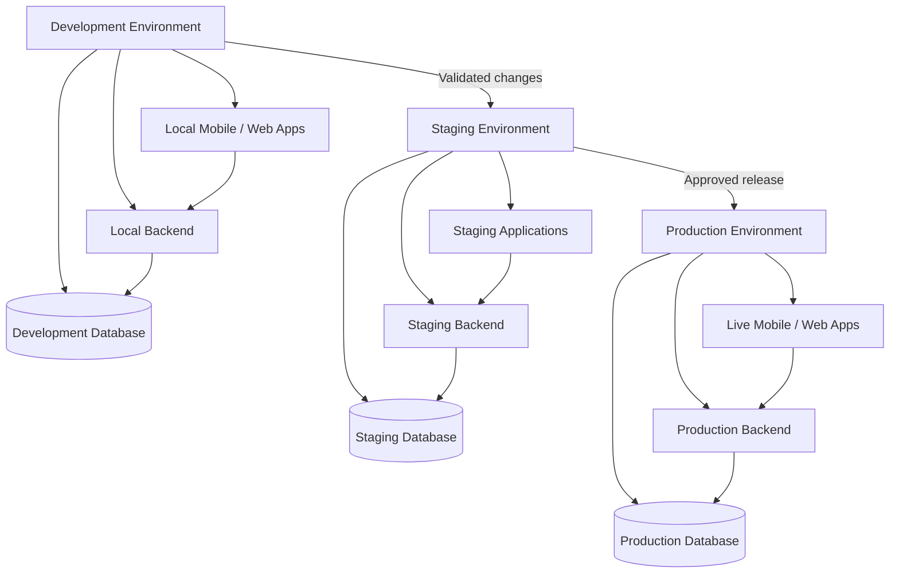

# Development, Staging and Production Environments

This diagram illustrates the three primary environments used throughout the Elixer development lifecycle.

```mermaid
flowchart TD
    DEV["Development Environment"]
    STAGING["Staging Environment"]
    PROD["Production Environment"]

    DEV_APP["Local Mobile / Web Apps"]
    DEV_API["Local Backend"]
    DEV_DB[("Development Database")]

    STAGE_APP["Staging Applications"]
    STAGE_API["Staging Backend"]
    STAGE_DB[("Staging Database")]

    PROD_APP["Live Mobile / Web Apps"]
    PROD_API["Production Backend"]
    PROD_DB[("Production Database")]

    DEV --> DEV_APP
    DEV --> DEV_API
    DEV --> DEV_DB

    DEV_APP --> DEV_API

    DEV_API --> DEV_DB

    DEV -->|Validated changes| STAGING

    STAGING --> STAGE_APP
    STAGING --> STAGE_API
    STAGING --> STAGE_DB

    STAGE_APP --> STAGE_API
    STAGE_API --> STAGE_DB

    STAGING -->|Approved release| PROD

    PROD --> PROD_APP
    PROD --> PROD_API
    PROD --> PROD_DB

    PROD_APP --> PROD_API
    PROD_API --> PROD_DB
```
