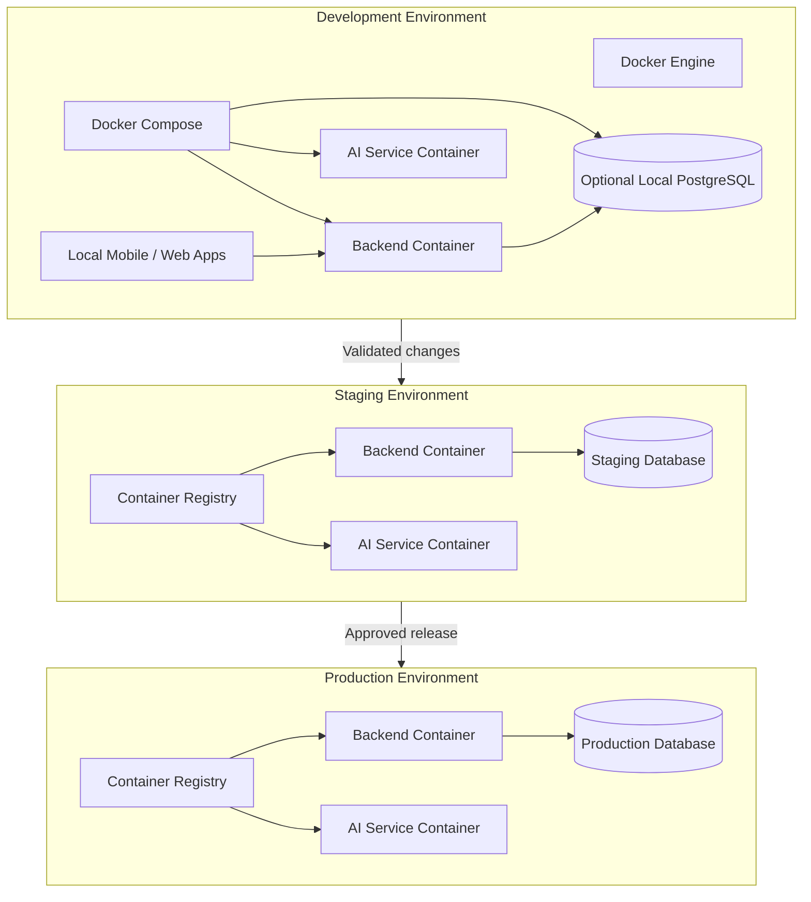

# Development, Staging and Production Environments

This diagram illustrates how Elixer separates development, staging and production environments, including Docker-based containerization.

```mermaid
flowchart TD
    subgraph DEV["Development Environment"]
        DEV_ENGINE["Docker Engine"]
        COMPOSE["Docker Compose"]

        DEV_APP["Local Mobile / Web Apps"]
        DEV_BACKEND["Backend Container"]
        DEV_AI["AI Service Container"]
        DEV_DB[("Optional Local PostgreSQL")]

        COMPOSE --> DEV_BACKEND
        COMPOSE --> DEV_AI
        COMPOSE --> DEV_DB

        DEV_APP --> DEV_BACKEND
        DEV_BACKEND --> DEV_DB
    end

    subgraph STAGING["Staging Environment"]
        STAGE_REGISTRY["Container Registry"]
        STAGE_BACKEND["Backend Container"]
        STAGE_AI["AI Service Container"]
        STAGE_DB[("Staging Database")]

        STAGE_REGISTRY --> STAGE_BACKEND
        STAGE_REGISTRY --> STAGE_AI

        STAGE_BACKEND --> STAGE_DB
    end

    subgraph PROD["Production Environment"]
        PROD_REGISTRY["Container Registry"]
        PROD_BACKEND["Backend Container"]
        PROD_AI["AI Service Container"]
        PROD_DB[("Production Database")]

        PROD_REGISTRY --> PROD_BACKEND
        PROD_REGISTRY --> PROD_AI

        PROD_BACKEND --> PROD_DB
    end

    DEV -->|"Validated changes"| STAGING
    STAGING -->|"Approved release"| PROD
```

